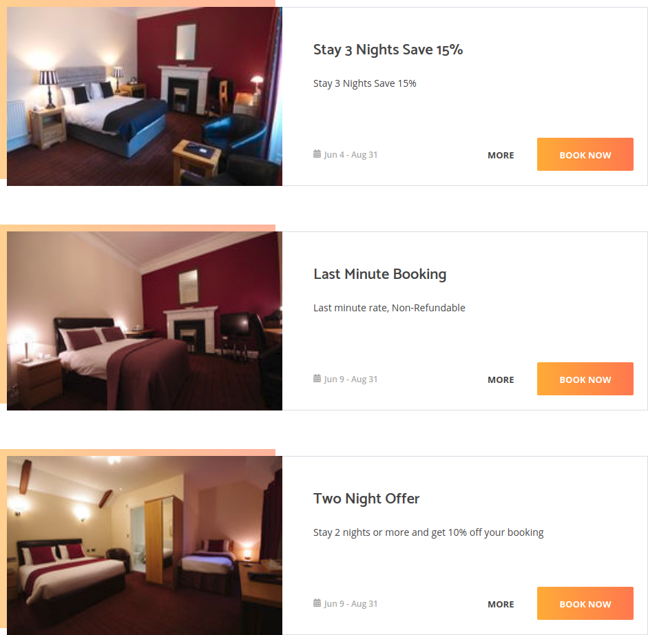
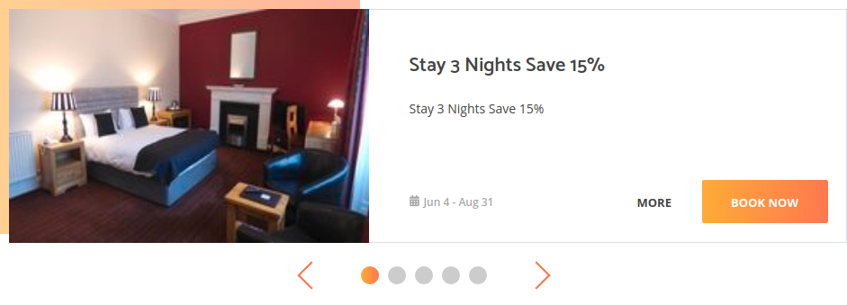
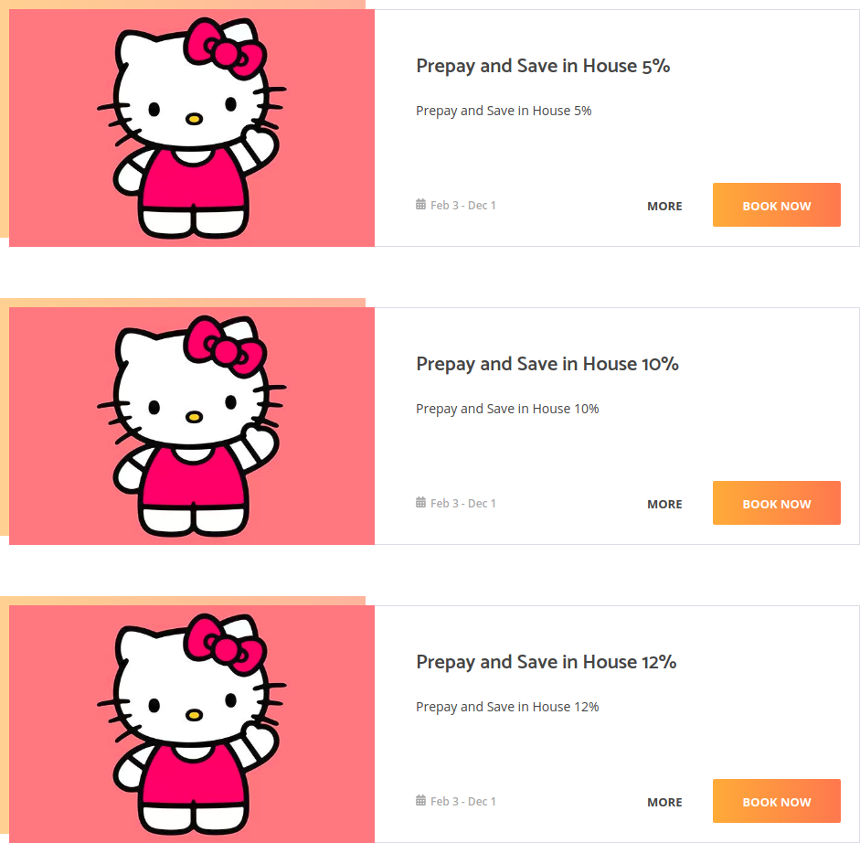

# special-offer-widget
The Booking Factory special offer widgets.
It allows you to display the special offer of your hotel on your website.
## How to use
Replace the template PLACE_YOUR_TOKEN_HERE with your token. Put the code in the body tag and save:
### Default view ([example](https://lakchmu.github.io/special-offer-widget/#default))
If you need a default view widget, use:
```html
<div class="special-offers"></div>
<script src="https://tbf-libraries.s3-eu-west-1.amazonaws.com/tbfSpecialOffers.latest.js"></script>
<script>
  TBFSpecialOffer('.special-offers', 'PLACE_YOUR_TOKEN_HERE');
</script>
```

### Carousel view ([example](https://lakchmu.github.io/special-offer-widget/#carousel))
If you need a carousel view widget, use:
```html
<div class="special-offers"></div>
<script src="https://tbf-libraries.s3-eu-west-1.amazonaws.com/tbfSpecialOffers.latest.js"></script>
<script>
  const options = { view: 'carousel' };
  TBFSpecialOffer('.special-offers', 'PLACE_YOUR_TOKEN_HERE', options);
</script>
```

### Without default styles
If you do not want use default styles, you may off our styles that way: add key/value _defaultCSS: false_ to _option_ object.
```html
const options = { defaultCSS: false };
```
### With your placeholder image
If you want use own placeholder image, add key/value _missingImageUrl: 'https://url-to-your-placeholder-image'_ to _option_ object. The size of the placeholder image should be 400px*260px.
```html
const options = { missingImageUrl: 'https://url-to-your-placeholder-image' };
```
